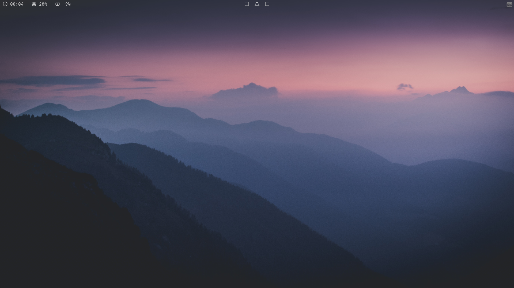

# Minimal i3-gaps config files

```
 ▄▄▄▄▄▄▄▄▄▄▄  ▄         ▄  ▄    ▄  ▄▄▄▄▄▄▄▄▄▄▄  ▄▄▄▄▄▄▄▄▄▄▄       ▄▄▄▄▄▄▄▄▄▄▄  ▄         ▄  ▄▄        ▄ 
▐░░░░░░░░░░░▌▐░▌       ▐░▌▐░▌  ▐░▌▐░░░░░░░░░░░▌▐░░░░░░░░░░░▌     ▐░░░░░░░░░░░▌▐░▌       ▐░▌▐░░▌      ▐░▌
▐░█▀▀▀▀▀▀▀█░▌▐░▌       ▐░▌▐░▌ ▐░▌ ▐░█▀▀▀▀▀▀▀▀▀ ▐░█▀▀▀▀▀▀▀█░▌     ▐░█▀▀▀▀▀▀▀▀▀ ▐░▌       ▐░▌▐░▌░▌     ▐░▌
▐░▌       ▐░▌▐░▌       ▐░▌▐░▌▐░▌  ▐░▌          ▐░▌       ▐░▌     ▐░▌          ▐░▌       ▐░▌▐░▌▐░▌    ▐░▌
▐░█▄▄▄▄▄▄▄█░▌▐░█▄▄▄▄▄▄▄█░▌▐░▌░▌   ▐░█▄▄▄▄▄▄▄▄▄ ▐░█▄▄▄▄▄▄▄█░▌     ▐░█▄▄▄▄▄▄▄▄▄ ▐░▌       ▐░▌▐░▌ ▐░▌   ▐░▌
▐░░░░░░░░░░░▌▐░░░░░░░░░░░▌▐░░▌    ▐░░░░░░░░░░░▌▐░░░░░░░░░░░▌     ▐░░░░░░░░░░░▌▐░▌       ▐░▌▐░▌  ▐░▌  ▐░▌
▐░█▀▀▀▀█░█▀▀  ▀▀▀▀█░█▀▀▀▀ ▐░▌░▌   ▐░█▀▀▀▀▀▀▀▀▀ ▐░█▀▀▀▀█░█▀▀       ▀▀▀▀▀▀▀▀▀█░▌▐░▌       ▐░▌▐░▌   ▐░▌ ▐░▌
▐░▌     ▐░▌       ▐░▌     ▐░▌▐░▌  ▐░▌          ▐░▌     ▐░▌                 ▐░▌▐░▌       ▐░▌▐░▌    ▐░▌▐░▌
▐░▌      ▐░▌      ▐░▌     ▐░▌ ▐░▌ ▐░█▄▄▄▄▄▄▄▄▄ ▐░▌      ▐░▌       ▄▄▄▄▄▄▄▄▄█░▌▐░█▄▄▄▄▄▄▄█░▌▐░▌     ▐░▐░▌
▐░▌       ▐░▌     ▐░▌     ▐░▌  ▐░▌▐░░░░░░░░░░░▌▐░▌       ▐░▌     ▐░░░░░░░░░░░▌▐░░░░░░░░░░░▌▐░▌      ▐░░▌
 ▀         ▀       ▀       ▀    ▀  ▀▀▀▀▀▀▀▀▀▀▀  ▀         ▀       ▀▀▀▀▀▀▀▀▀▀▀  ▀▀▀▀▀▀▀▀▀▀▀  ▀        ▀▀ 
```

# How to install?

```
rm -rf ~/.config/alacritty/ && mv alacritty/ ~/.config/ && rm -rf ~/.fonts/ && mv fonts/ ~/.fonts && rm -rf ~/.config/helix/ && mv helix/ ~/.config/ && rm -rf ~/.config/i3/ && mv i3/ ~/.config/ && rm -rf ~/.config/lazygit/ && mv lazygit/ ~/.config/ && rm -rf ~/.config/picom/ && mv picom/ ~/.config/ && rm -rf ~/.config/polybar/ && mv polybar/ ~/.config/ && rm -rf ~/.config/rofi/ && mv rofi/ ~/.config/ && rm -rf ~/Screenshot && mkdir ~/Screenshot && fc-cache -fv
```

this command will change these files.

* alacritty config
* fonts (JetBrainsMono Nerd Font and polybar theme fonts)
* helix config
* i3 config
* lazygit config
* picom config
* polybar theme
* rofi theme

# Result


