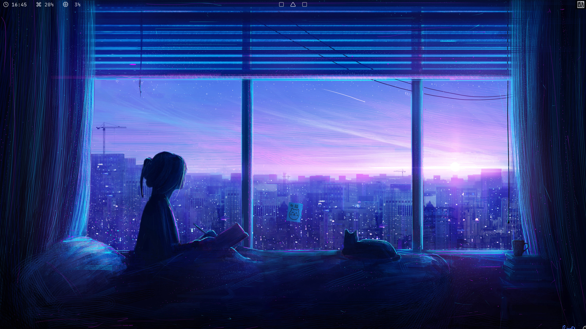

# Minimal i3-gaps config files

```
 ▄▄▄▄▄▄▄▄▄▄▄  ▄         ▄  ▄    ▄  ▄▄▄▄▄▄▄▄▄▄▄  ▄▄▄▄▄▄▄▄▄▄▄       ▄▄▄▄▄▄▄▄▄▄▄  ▄         ▄  ▄▄        ▄ 
▐░░░░░░░░░░░▌▐░▌       ▐░▌▐░▌  ▐░▌▐░░░░░░░░░░░▌▐░░░░░░░░░░░▌     ▐░░░░░░░░░░░▌▐░▌       ▐░▌▐░░▌      ▐░▌
▐░█▀▀▀▀▀▀▀█░▌▐░▌       ▐░▌▐░▌ ▐░▌ ▐░█▀▀▀▀▀▀▀▀▀ ▐░█▀▀▀▀▀▀▀█░▌     ▐░█▀▀▀▀▀▀▀▀▀ ▐░▌       ▐░▌▐░▌░▌     ▐░▌
▐░▌       ▐░▌▐░▌       ▐░▌▐░▌▐░▌  ▐░▌          ▐░▌       ▐░▌     ▐░▌          ▐░▌       ▐░▌▐░▌▐░▌    ▐░▌
▐░█▄▄▄▄▄▄▄█░▌▐░█▄▄▄▄▄▄▄█░▌▐░▌░▌   ▐░█▄▄▄▄▄▄▄▄▄ ▐░█▄▄▄▄▄▄▄█░▌     ▐░█▄▄▄▄▄▄▄▄▄ ▐░▌       ▐░▌▐░▌ ▐░▌   ▐░▌
▐░░░░░░░░░░░▌▐░░░░░░░░░░░▌▐░░▌    ▐░░░░░░░░░░░▌▐░░░░░░░░░░░▌     ▐░░░░░░░░░░░▌▐░▌       ▐░▌▐░▌  ▐░▌  ▐░▌
▐░█▀▀▀▀█░█▀▀  ▀▀▀▀█░█▀▀▀▀ ▐░▌░▌   ▐░█▀▀▀▀▀▀▀▀▀ ▐░█▀▀▀▀█░█▀▀       ▀▀▀▀▀▀▀▀▀█░▌▐░▌       ▐░▌▐░▌   ▐░▌ ▐░▌
▐░▌     ▐░▌       ▐░▌     ▐░▌▐░▌  ▐░▌          ▐░▌     ▐░▌                 ▐░▌▐░▌       ▐░▌▐░▌    ▐░▌▐░▌
▐░▌      ▐░▌      ▐░▌     ▐░▌ ▐░▌ ▐░█▄▄▄▄▄▄▄▄▄ ▐░▌      ▐░▌       ▄▄▄▄▄▄▄▄▄█░▌▐░█▄▄▄▄▄▄▄█░▌▐░▌     ▐░▐░▌
▐░▌       ▐░▌     ▐░▌     ▐░▌  ▐░▌▐░░░░░░░░░░░▌▐░▌       ▐░▌     ▐░░░░░░░░░░░▌▐░░░░░░░░░░░▌▐░▌      ▐░░▌
 ▀         ▀       ▀       ▀    ▀  ▀▀▀▀▀▀▀▀▀▀▀  ▀         ▀       ▀▀▀▀▀▀▀▀▀▀▀  ▀▀▀▀▀▀▀▀▀▀▀  ▀        ▀▀ 
```

# How to install?

Run this command: 

```
rm -rf ~/.config/alacritty/ && mv alacritty/ ~/.config/ && rm -rf ~/.fonts/ && mv fonts/ ~/.fonts && rm -rf ~/.config/helix/ && mv helix/ ~/.config/ && rm -rf ~/.config/i3/ && mv i3/ ~/.config/ && rm -rf ~/.config/lazygit/ && mv lazygit/ ~/.config/ && rm -rf ~/.config/picom/ && mv picom/ ~/.config/ && rm -rf ~/.config/polybar/ && mv polybar/ ~/.config/ && rm -rf ~/.config/rofi/ && mv rofi/ ~/.config/ && rm -rf ~/Screenshot && mkdir ~/Screenshot && rm -rf ~/.xinitrc && mv xinitrc ~/.xinitrc && rm -rf ~/.Xresources && mv Xresources ~/.Xresources && sudo rm -rf /etc/environment && sudo mv environment /etc/ && sudo rm -rf /usr/local/bin/rofi-power-menu && sudo mv bin/rofi-power-menu /usr/local/bin/ && fc-cache -fv && cd sekiro_grub_theme/ && sudo ./install.sh
```

Or you can just `cd` into this folder and run `./install.sh`

# Effects

* alacritty config file
* ~/.fonts (JetBrains Mono Nerd Font and some polybar fonts)
* helix editor config files
* i3 config file
* lazygit config file
* picom config file
* polybar config files
* rofi config files
* ~/Screenshot (new empty folder)
* ~/.xinitrc (exec i3 and include .Xresources)
* ~/.Xresources (i3 with 1.2 zoom level)
* /etc/environment (environment with fcitx5)
* /usr/local/bin/rofi-power-menu (rofi power menu)
* fc-cache -fv (reload fonts)
* install sekiro_grub_theme

# Enable the dark mode

If you want to enable the dark mode, just run the `enable_dark_mode.sh` in `gtk-3.0/`

```
# gtk-3.0/enable_dark_mode.sh

 ./enable_dark_mode.sh
```

# SDDM theme

## install sddm

```
sudo pacman -S sddm
```

## enable sddm service

```
sudo systemctl enable sddm
```

## install sddm theme

```
yay -S sddm-theme-astronaut
```

## enable theme

```
sudo vim /usr/lib/sddm/sddm.conf.d/default.conf
```

change these line.

```
[Theme]
# Current theme name
Current=astronaut
```

# Result


